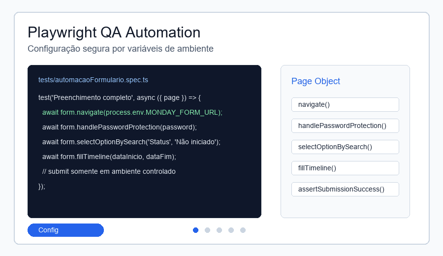

# Monday Form Automation

Automação de testes end-to-end com Playwright para validar o preenchimento de formulários Monday.com, incluindo autenticação opcional, campos de texto, dropdowns e cronograma.



## Visão geral

Este projeto demonstra uma estrutura de QA Automation em TypeScript usando Page Object Model para reduzir duplicação e deixar os testes mais legíveis. O alvo é um formulário Monday.com configurável por variável de ambiente, evitando expor URLs privadas, senhas ou dados reais no repositório.

## Demonstração

O GIF mostra o fluxo esperado da automação:

* abrir um formulário configurado;
* autenticar quando houver proteção por senha;
* preencher campos principais;
* selecionar opções em dropdowns;
* preencher datas de cronograma;
* manter o envio final controlado para evitar submissões acidentais.

## Funcionalidades

* Teste Playwright em TypeScript.
* Page Object para interações reutilizáveis do formulário.
* Suporte a formulário protegido por senha via variável de ambiente.
* Seleção de dropdown por busca.
* Preenchimento de campos de timeline/cronograma.
* Execução local, headed e UI mode.
* Relatórios e traces ignorados pelo Git.

## Stack

| Camada | Tecnologias |
| --- | --- |
| Testes E2E | Playwright |
| Linguagem | TypeScript |
| Padrão | Page Object Model |
| Alvo | Monday.com Forms |

## Arquitetura

```text
tests/automacaoFormulario.spec.ts
      |
      v
Pages/MondayFormPage.ts
      |
      v
Playwright page/locators
      |
      v
Monday.com Form configurado por ambiente
```

## Como executar

Instale as dependências:

```bash
npm install
```

Instale os navegadores do Playwright:

```bash
npx playwright install
```

Crie um arquivo `.env` local com base em `.env.example`:

```env
MONDAY_FORM_URL=https://forms.monday.com/forms/your-demo-form-id
MONDAY_FORM_PASSWORD=optional-demo-password
```

Execute:

```bash
npm test
```

Modo visual:

```bash
npm run test:headed
npm run test:ui
```

## Como testar

O teste principal valida:

* navegação até o formulário;
* autenticação opcional;
* preenchimento de nome;
* seleção de origem, status e prioridade;
* preenchimento de data inicial e final;
* fluxo seguro sem submissão real por padrão.

Para permitir envio real, revise o ambiente de teste e descomente explicitamente as chamadas `submit()` e `assertSubmissionSuccess()` no spec.

## O que este projeto demonstra

* Automação E2E com Playwright.
* Uso de TypeScript em testes.
* Page Object Model aplicado a formulário real.
* Separação de configuração sensível via variáveis de ambiente.
* Cuidado com evidências, traces e relatórios gerados.
* Boas práticas para evitar submissão acidental em ambiente externo.

## Próximos passos

* Adicionar fixtures para múltiplos perfis de formulário.
* Criar testes negativos para campos obrigatórios.
* Parametrizar labels por arquivo de configuração.
* Publicar relatório de exemplo usando dados fictícios.
